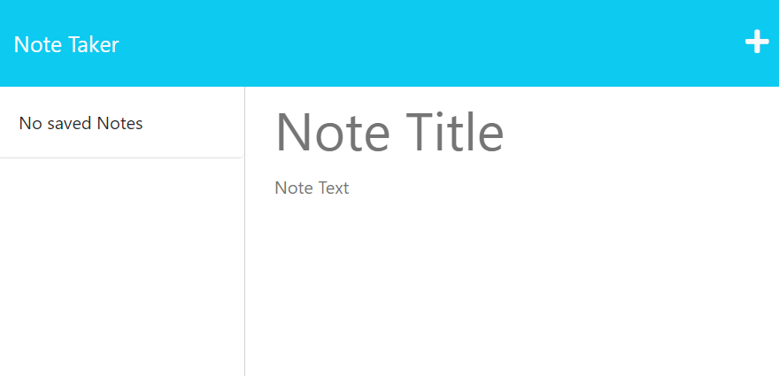
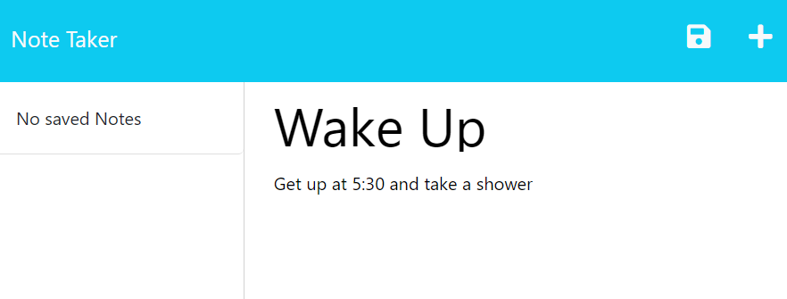
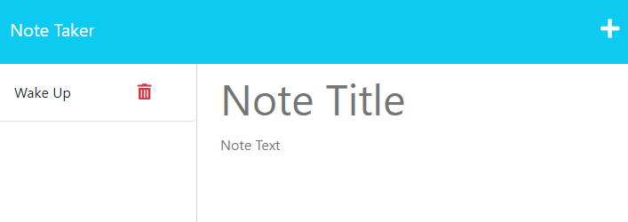

# Note Taker
  
  
  ## Description
 The application will save and retrieve notes from a JSON file.

  The application was created using the following criteria:
  - When on notes page existing notes listed in the left-hand column
  - When a new note is entered into the text fields a save button appears
  - When click on save button the note appears in the left-hand column with existing notes
  - When click on an existing note the information populates in the note fields
  - When click on the trash can button the note is deleted

  ## Table of Contents
- [Installation](#installation)
- [Usage](#usage)
- [License](#license)
- [Contributing](#contributing)
 
## Installation
In order to use the application node.js will need to be installed.  
Node.js Installation: https://nodejs.org/en/download 

Express is used to create routes for the application and uuid was used to generate random ids for notes. 

## Usage
The program is deployed in heroku link below. Click on the get started button on the landing page. This will direct you to the notes page. Add notes by typing in title and text then clicking the save button. Clicking on saved notes in the left-hand column it will populate in the main section. Clicking on the trash can button will delete that particular note. Clicking on the plus button will allow you to write a new note.  
To run program from IDE type node server.js into the terminal. Click into the website link in the terminal to view note taker.

 
 
 

## License 
MIT License

## Contributing
The following websites were used for reference to create this application: 
https://github.com/uuidjs/uuid#uuidv4options-buffer-offset

## Heroku Deployment
[Heroku Link](https://fast-temple-76500-f5720780989c.herokuapp.com/)

